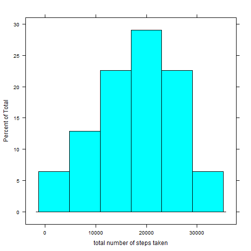
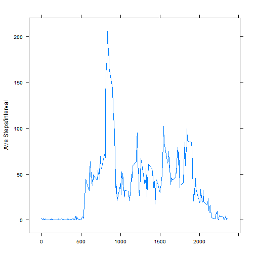
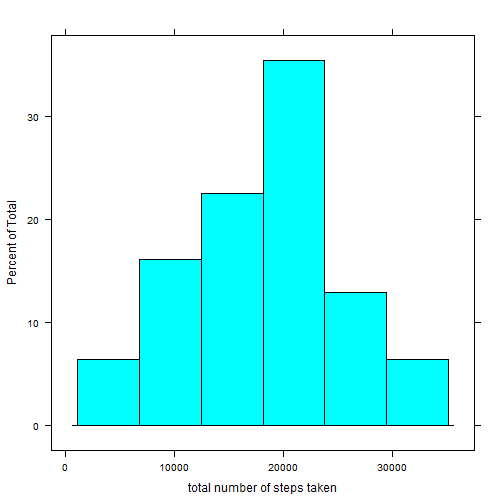
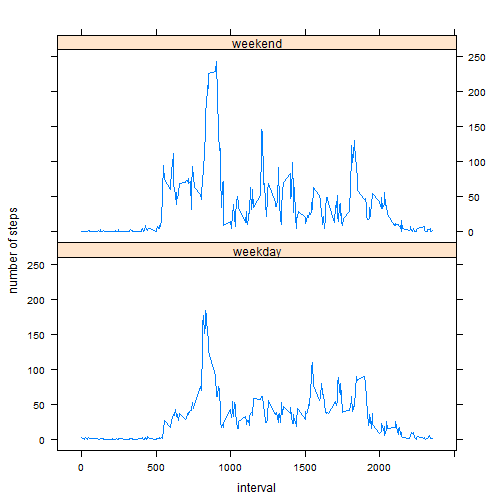

# Reproducible Research: Peer Assessment 1


## Loading and preprocessing the data


```r

Sys.setlocale("LC_ALL", "english")
```

```
## [1] "LC_COLLATE=English_United States.1252;LC_CTYPE=English_United States.1252;LC_MONETARY=English_United States.1252;LC_NUMERIC=C;LC_TIME=English_United States.1252"
```

```r

activity <- read.csv("activity.csv")
activity$date <- as.Date(activity$date, "%Y-%M-%d")
```


## What is mean total number of steps taken per day?

```r
library(lattice)
# with(activity, hist(tapply(steps, date, sum, na.rm = TRUE), xlab = 'total
# number of steps taken'))
with(activity, histogram(tapply(steps, date, sum, na.rm = TRUE), xlab = "total number of steps taken"))
```

 

```r
print(m1 <- with(activity, mean(tapply(steps, date, sum, na.rm = TRUE))))
```

```
## [1] 18407
```

```r
print(m2 <- with(activity, median(tapply(steps, date, sum, na.rm = TRUE))))
```

```
## [1] 20525
```

The mean value of total number of steps taken per day is 1.8407 &times; 10<sup>4</sup>
The median value of total number of steps take per day is 20525


## What is the average daily activity pattern?

```r
# with(activity, plot(unique(interval), tapply(steps, interval, mean, na.rm
# = TRUE), type = 'l', xlab = '', ylab = 'Ave Steps/interval'))
xyplot(tapply(steps, interval, mean, na.rm = TRUE) ~ unique(interval), data = activity, 
    type = "l", xlab = "", ylab = "Ave Steps/interval")
```

 

```r
print(max_interval_ind <- with(activity, which.max(tapply(steps, interval, mean, 
    na.rm = TRUE))))
```

```
## 835 
## 104
```

```r
print(max_interval <- with(activity, tapply(steps, interval, mean, na.rm = TRUE)[[max_interval_ind]]))
```

```
## [1] 206.2
```

the 5-minute interval, on average across all the days in the dataset, contains the maximum number of steps is in interval 835 and maxium average of steps by interval is 206.1698
## Imputing missing values

```r
print(num_missing <- nrow(activity[is.na(activity$steps), ]))
```

```
## [1] 2304
```

The total number of missing values in the dataset is  2304

Because it seems that the observations of certain days are all missing, it is preferrable to use median value of 5-minute interval to replace missing value

```r
m2 <- with(activity, tapply(steps, interval, median, na.rm = TRUE))
complete_activity <- activity
complete_activity$steps <- mapply(function(s, i) ifelse(is.na(s), m2[[as.character(i)]], 
    s), activity$steps, activity$interval)
```


```r
with(complete_activity, histogram(tapply(steps, date, sum), xlab = "total number of steps taken"))
```

 

```r
print(m1 <- with(complete_activity, mean(tapply(steps, date, sum, na.rm = TRUE))))
```

```
## [1] 18701
```

```r
print(m2 <- with(complete_activity, median(tapply(steps, date, sum, na.rm = TRUE))))
```

```
## [1] 20525
```


## Are there differences in activity patterns between weekdays and weekends?
an additional factor variable w_day_flag is created 

```r
# Create a new factor variable in the dataset with two levels ¨C ¡°weekday¡±
# and ¡°weekend¡± #indicating whether a given date is a weekday or weekend
# day
complete_activity <- within(complete_activity, wday_flag <- factor(ifelse(weekdays(activity$date) %in% 
    c("Saturday", "Sunday"), "weekend", "weekday")))
weekday_act <- as.data.frame(with(subset(complete_activity, wday_flag == "weekday"), 
    tapply(steps, interval, mean)))
colnames(weekday_act) <- "steps"
weekday_act$w_day_flag <- "weekday"
weekday_act$interval <- rownames(weekday_act)

weekend_act <- as.data.frame(with(subset(complete_activity, wday_flag == "weekend"), 
    tapply(steps, interval, mean)))
colnames(weekend_act) <- "steps"
weekend_act$w_day_flag <- "weekend"
weekend_act$interval <- rownames(weekend_act)

act_sum <- rbind(weekday_act, weekend_act)
act_sum$w_day_flag <- as.factor(act_sum$w_day_flag)
act_sum$interval <- as.numeric(act_sum$interval)
xyplot(steps ~ interval | w_day_flag, data = act_sum, type = "l", layout = c(1, 
    2), ylab = "number of steps")
```

 

